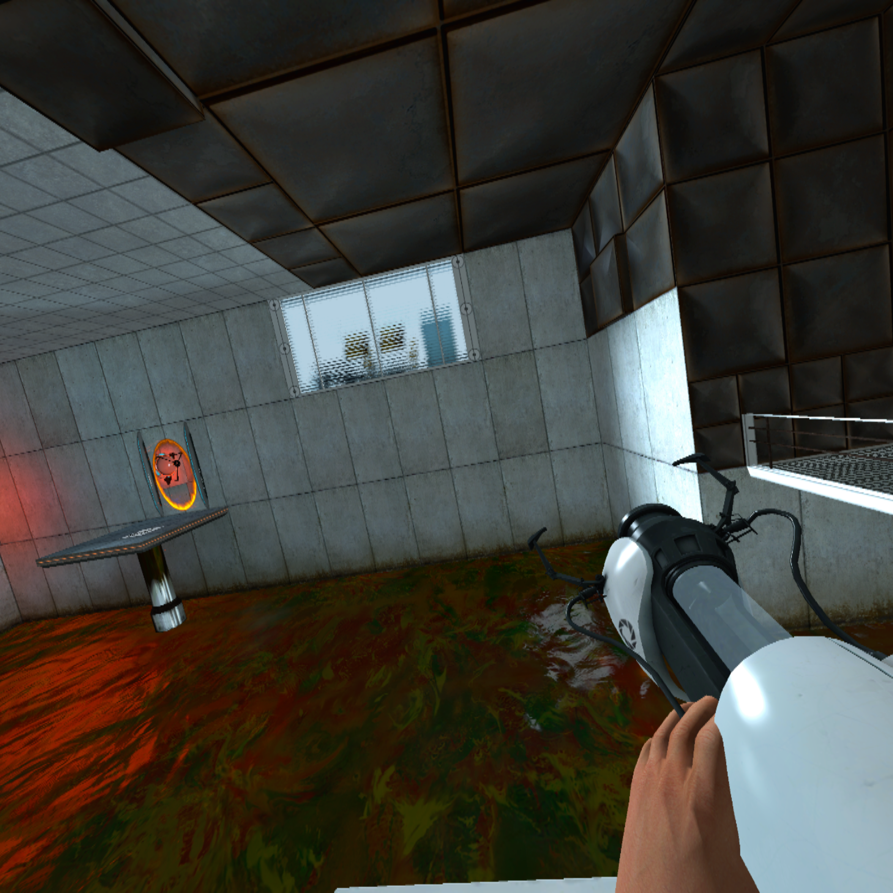
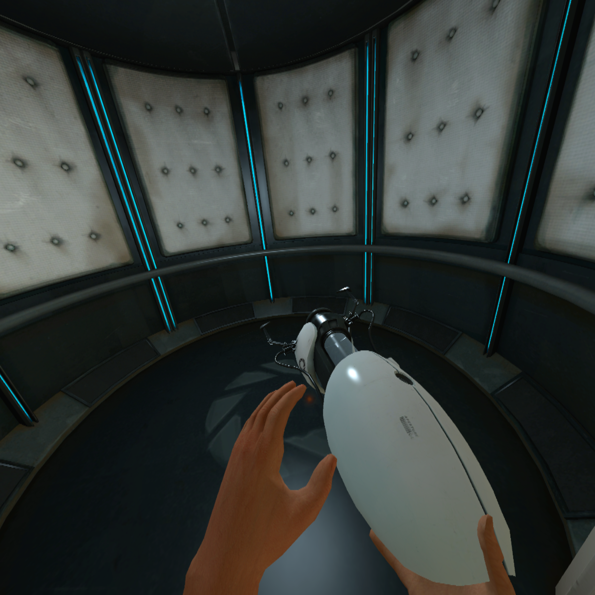

<p align="center">
  
</p>

# Portal 1 VR

VR mod for the Windows x86 Steam version of Portal, based on [Portal2VR](https://github.com/Gistix/portal2vr) and [L4D2VR](https://github.com/sd805/l4d2vr).

## Screenshots

Captured while playing Portal 1 VR fullscreen with a Pico headset through SteamVR. These are actual headset views from the playtest. Click either picture for the full-size image.

| Portal gun in the test chamber | Both hands in the elevator |
| --- | --- |
| [](imgs/screenshots/portal1vr-playtest-1.png) | [](imgs/screenshots/portal1vr-playtest-2.png) |

## Installation

Close Portal. Extract the runtime archive into `steamapps/common/Portal`, merging its `bin` and `portal` folders. The `portal/custom/portal1vr/materials` files correct the stock arms texture lookup. Connect the headset through its PC VR software and start SteamVR first.

Run `Launch Portal VR.cmd` for fullscreen using Portal's configured resolution, or launch Portal with:

```text
-insecure -fullscreen -novid +mat_queue_mode 0 +mat_vsync 0 +mat_antialias 0
```

Choose your preferred display resolution in Portal's video options, then load a chapter. The left stick moves, the right stick turns, and clicking the left stick recenters the headset. Controller bindings are in `bin/VR/SteamVRActionManifest`; SteamVR's Pico-to-Oculus compatibility mapping was used during testing. Configuration is loaded from `bin/VR/config.txt` at startup.

`RenderWindow=1` provides a separate desktop view and the pause-menu texture. It adds a third scene render. Leave it enabled for the tested configuration.

## Runtime fixes

- Start VR on the render thread after the engine and D3D device are ready. SteamVR initialization failures can retry without crashing normal rendering.
- Use Portal's x86 engine interfaces and camera structure instead of Portal 2's incompatible layouts.
- Resolve client objects through checked RTTI and validate optional hook signatures.
- Preserve the desktop camera, render each eye separately, and update the engine's view angles from the headset.
- Refresh the submitted eye surfaces when Portal reallocates render targets on map load. The old surfaces produced a black headset image even though SteamVR accepted them.
- Install the action manifest and controller bindings correctly. Guard missing controller poses and use the correct input and cursor interfaces.
- Hook Portal 1's eight-argument, float-returning `TraceFirePortal` so placement follows the controller instead of head aim.
- Attach the portal gun at its wrist bone, with the barrel aligned to the shot direction. Transform copies of the bone matrices so eye renders do not compound the pose.
- Render bare arms with independently tracked left/right bone chains, and create the player's second viewmodel to retain the left arm while holding the gun.
- Disable world-player bone merging and reconstruct bare arms from their reference skeleton. The old hands animation displaced the wrists from their forearm attachment points. The gun forearm is also rotated into a neutral wrist pose without moving the hand or gun.
- Override the broken stock arm material path through Portal's custom-content folder, using textures already installed with the game. The gun hand uses a filled skin region because its UV layout does not match this atlas; this avoids black pixels but does not restore its original nail/tattoo detailing.

## Validation and limits

Tested locally against Portal client.dll timestamp `0x68362d89`, with a Pico headset through SteamVR. The tester confirmed a visible room, working head rotation, and left-stick movement. Captured eye render targets contain the scene, and both SteamVR eye submissions return success. This confirms basic VR operation, not a complete campaign playthrough.

The tester also confirmed controller-directed portal placement and independent arm movement in an early room without the gun. After the gun wrist adjustment, the remaining reported issue was a black hand. This was traced to incompatible texture coordinates and corrected with a material transform. Fresh playtest screenshots show both hands with skin-colored materials. The fullscreen playtest retained successful eye submissions, head tracking, movement, and controller-directed shots. These are controller-driven arms, without full-body elbow tracking or finger tracking. Legacy laser-particle and specialized portal-transition hooks remain disabled where their signatures do not match. Pause-menu behavior and a complete campaign playthrough still need testing.

The gun-hand grip correction is 2.5 Source units backward and 1 unit left. `ViewmodelPosCustomOffsetX/Y/Z` add forward/right/up adjustments in Source units; at the default scale, one unit is about 2.3 cm. Restart Portal after changing configuration.

## Build

Install Visual Studio 2022 C++ build tools with the Windows SDK, and Git. Clone this repository recursively, then:

```powershell
./build.ps1
./L4D2VR/copy-to-portal.ps1 -SourceDll ./Release/d3d9.dll -PortalDirectory 'C:\Program Files (x86)\Steam\steamapps\common\Portal'
```

`build.ps1` applies `patches/dxvk-portal-startup.patch` to the pinned DXVK submodule before building Release x86. If using the Visual Studio solution directly, first run `patches/apply-dxvk-patch.ps1` and select x86 and your installed toolset. The patch is stored in the parent repository so the DXVK fixes survive a fresh clone.

From an x86 Native Tools Command Prompt, run `powershell -File tests/run.ps1` for the interface-layout, calling-convention, trace-filter, model-name, wrist-transform, and independent-arm regression checks.

For render debugging only, add `-portalvr-debug-textures`. It saves left/right/desktop BMP images at three early frame counts in the Portal directory. Normal launches do not perform these GPU readbacks. Runtime diagnostics are in `portalvr.log`.

## Credits

[Portal2VR](https://github.com/Gistix/portal2vr), [L4D2VR](https://github.com/sd805/l4d2vr), [VirtualFortress2](https://github.com/PinkMilkProductions/VirtualFortress2), [gmcl_openvr](https://github.com/Planimeter/gmcl_openvr), [DXVK](https://github.com/fholger/dxvk_l4d2vr), and [Source SDK 2013](https://github.com/ValveSoftware/source-sdk-2013).

Portal logo: Valve. Screenshots captured during local VR playtesting. [Image sources](imgs/SOURCES.md).
