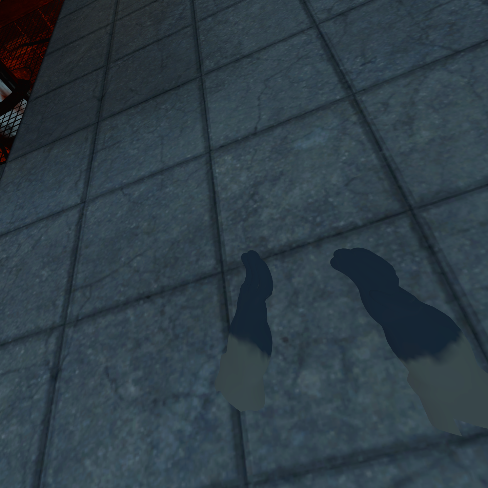

<p align="center">
  
</p>

# Portal 1 VR

VR mod for the Windows x86 Steam version of Portal, based on [Portal2VR](https://github.com/Gistix/portal2vr) and [L4D2VR](https://github.com/sd805/l4d2vr).

## Screenshots

Captured while playing Portal 1 VR fullscreen with a Pico headset through SteamVR. These are actual headset views from the playtest. Click either picture for the full-size image.

| Portal gun in the test chamber | Both hands in the elevator | Fresh Pico playtest |
| --- | --- | --- |
| [](imgs/screenshots/portal1vr-playtest-1.png) | [](imgs/screenshots/portal1vr-playtest-2.png) | [](imgs/screenshots/portal1vr-playtest-3.png) |

## Installation

Close Portal. Extract the runtime archive into `steamapps/common/Portal`, merging its `bin` and `portal` folders. The `portal/custom/portal1vr/materials` files correct the stock arms texture lookup. Connect the headset through its PC VR software and start SteamVR first.

Run `Launch Portal VR.cmd` for fullscreen using Portal's configured resolution, or launch Portal with:

```text
-insecure -fullscreen -novid +mat_queue_mode 0 +mat_vsync 0 +mat_antialias 0
```

Choose your preferred display resolution in Portal's video options, then load a chapter. The left stick moves, the right stick turns, and clicking the left stick recenters the headset. Controller bindings are in `bin/VR/SteamVRActionManifest`; SteamVR's Pico-to-Oculus compatibility mapping was used during testing. Configuration is loaded from `bin/VR/config.txt` at startup.

`RenderWindow=1` provides a separate desktop view and the pause-menu texture. It adds a third scene render. Leave it enabled for the tested configuration.

## Runtime fixes

- Start VR on the render thread after the engine and D3D device are ready. SteamVR initialization failures can retry without crashing normal rendering.
- Use Portal's x86 engine interfaces and camera structure instead of Portal 2's incompatible layouts.
- Resolve client objects through checked RTTI and validate optional hook signatures.
- Preserve the desktop camera, render each eye separately, and update the engine's view angles from the headset.
- Preserve the monitor resolution during D3D device resets. Eye textures have their own resolution; applying that resolution to the fullscreen desktop could freeze rendering after a focus change.
- Sweep a camera hull from the player's eye position to the room-scale headset position. Solid walls, doors, glass, and props stop the view before either eye or its near plane crosses the surface. Both hands receive the same correction, and leaning back restores the normal tracking position without moving the tracking origin.
- Match Portal 1's collision-ray layout, with the ray/swept flags at bytes 64/65. The extra Portal 2 field made the engine treat moving traces as stationary, allowing the headset through walls.
- Refresh the submitted eye surfaces when Portal reallocates render targets on map load. The old surfaces produced a black headset image even though SteamVR accepted them.
- Retain the named eye targets across save loads so VR does not reopen material-system allocation during restoration; continue refreshing their underlying surfaces on binding.
- Use Portal 1's one-argument player-portal callback to turn tracking and both hands immediately, including crossings with little positional displacement. Rebuild server pickup poses relative to the current player eye pose so an entry-side sample follows a server teleport. Limit eye overrides to use/pickup callbacks so ordinary portal physics sees the player's head.
- Install the action manifest and controller bindings correctly. Guard missing controller poses and use the correct input and cursor interfaces.
- Hook Portal 1's eight-argument, float-returning `TraceFirePortal` so placement follows the controller instead of head aim.
- Attach the portal gun at its wrist bone, with the barrel aligned to the shot direction. Transform copies of the bone matrices so eye renders do not compound the pose.
- Render bare arms with independently tracked left/right bone chains, and create the player's second viewmodel to retain the left arm while holding the gun.
- Disable world-player bone merging and reconstruct bare arms from their reference skeleton. The old hands animation displaced the wrists from their forearm attachment points. The gun hand uses its authored wrist frame fitted to Portal's original grip, preserving the gun mesh and firing direction.
- Draw the first-person body before the main world view is popped, separately for each eye and the optional desktop view. Match the model eye midpoint to the center camera horizontally while preserving animated foot height. Show this copy only when looking down at least 30 degrees. With `FirstPersonBodyHideUpper=true`, retain the torso and collapse only the head and arms at their neck/shoulder attachments; normal portal/world renderings retain the complete model.
- Map bare hands to mirrored controller wrist frames. Finger hinges use the rebuilt model's joint positions, so differing bone rolls cannot reverse the thumb. Valid zero skeletal curl opens a bare hand; missing or inactive skeletal data uses a relaxed fallback. The gun hand retains a resting grip with independent trigger motion, so an open controller reading does not release the handle.
- Define separate Source QC eyeballs and eye materials using the existing iris artwork. Eye centers, gaze controllers, and head-local attachments match the mesh. The first-person body uses the authored eyes attachment for camera alignment, with the old eye-bone midpoint as a fallback.
- Resolve the server player's entity handle through its current virtual interface. The old unmatched `entindex` signature silently disabled the controller pickup hooks. Use the controller origin and angles during the pickup trace and held-object solver, while keeping the headset camera independent.
- Override the broken stock arm material path through Portal's custom-content folder, using textures already installed with the game. The gun hand uses a filled skin region because its UV layout does not match this atlas; this avoids black pixels but does not restore its original nail/tattoo detailing.

## Validation and limits

Tested locally against Portal client.dll timestamp `0x68362d89`, with a Pico headset through SteamVR. The tester confirmed a visible room, working head rotation, and left-stick movement. Captured eye render targets contain the scene, and both SteamVR eye submissions return success. This confirms basic VR operation, not a complete campaign playthrough.

The tester also confirmed controller-directed portal placement and independent arm movement in an early room without the gun. The custom VPK supplies the authored hand textures and rebuilt mirrored hand models. Model symmetry, normalized weights, finger motion, trigger isolation, and the Release x86 build pass local checks. Body weights mirror exactly in Blender and the exported SMDs. The September 14 Pico test loaded the textured models after rebuilding the archive with Portal's own VPK packer; live logs also show controller position and angles reaching the pickup hooks. The latest gun grip was inspected in rendered poses using the runtime's compiled bone transforms. The compiled body contains two correctly placed eyeballs, separate eye materials, gaze controls, and corrected eye-position metadata. The final eye appearance and grip comfort in Pico, pickup through portals, and a complete campaign playthrough still require user validation.

The gun-hand grip correction is 2.5 Source units backward and 1 unit left. `ViewmodelPosCustomOffsetX/Y/Z` add forward/right/up adjustments in Source units; at the default scale, one unit is about 2.3 cm. Restart Portal after changing configuration.

`FirstPersonBody=true` enables the local body when looking down at least 30 degrees, in both VR eyes and the separate desktop mirror (`RenderWindow=1`). Keep `FirstPersonBodyHideUpper=true` to hide the head and untracked arms while showing the chest, torso, and legs. This affects only the temporary first-person rendering. Set `FirstPersonBody=false` to disable the feature, or set `FirstPersonBodyHideUpper=false` only when testing the unmasked full player model.

`FirstPersonBodyBackOffset=8` moves the first-person body backward from its camera-aligned position by eight Source units (about 19 cm at the default VR scale). It uses horizontal heading, preserving foot height as you look down. Values from 0 to 24 are supported; restart Portal after changing it. The tracked hands, gun, collision, and full model seen through portals keep their existing transforms. The default addresses the reported forward torso placement; final comfort still needs headset confirmation.

The camera-collision update passes the Release x86 build and regression checks and has been installed for Pico testing. Its ray flags were checked against the installed engine.dll and corrected to Portal 1's layout. A live downward hull probe returned a floor hit at fraction `0.015059`. During play, the camera then logged blocked contact and recovery to zero correction, with successful submissions to both eyes. The Pico tester confirmed the wall fix works. Passage through active portals with this update still needs verification.

The custom Chell body and both viewmodels are stored losslessly in `L4D2VR/custom/bowman_portal1.zip`. The installer extracts its single `bowman_portal1.vpk` into `portal/custom`. Manual installers should extract that VPK there too, replacing the previous Bowman VPK. ZIP compression keeps the repository asset below GitHub's file-size limit without reducing texture resolution.

The September 23 avatar rebuild retains all 136 expression targets, with 88 direct expression controls and a selector for every target. The right palm sits underneath the portal gun. Finger joints match the paw mesh, distal pads follow their own finger chains, and the runtime avoids the previous forced fist that folded the outer pad and palm. Mesh and skeleton bind transforms were checked against the compiled models.

Optional left-hand support remains free until a fresh grip squeeze near the underside socket. Release grip or pull away to resume independent tracking. `LeftHandGunGrip=false` disables support; `LeftHandGunGripRadius=6` sets the default engagement distance in Source units. Missing tracking or socket data releases support. The supplied controller bindings add support inputs while retaining their existing actions; saved custom layouts may need the support action added manually. Right-hand aiming is unchanged.

The fresh body/viewmodel compiles, expression checks, five sampled gun-grip poses, optional-support clearance, and Release x86 regression tests pass. These changes have not been tested in a headset. The clearance checks concern hands against the gun and each other at the authored support pose; they are not a guarantee against all finger self-contact or arbitrary tracked poses.

## Build

The September 23 portal/pickup and save-load changes pass the Release x86 build and automated pose checks. A live Pico run confirmed both new hooks attach, controller pickup reaches the scoped eye overrides, a portal crossing updates tracking by 90 degrees, and both eyes continue receiving frames afterward. Held-prop behavior during crossing and repeated save-load textures still need gameplay confirmation. Check carrying a cube through both directions, releasing it afterward, and loading a save repeatedly while watching chamber textures.

Install Visual Studio 2022 C++ build tools with the Windows SDK, and Git. Clone this repository recursively, then:

```powershell
./build.ps1
./L4D2VR/copy-to-portal.ps1 -SourceDll ./Release/d3d9.dll -PortalDirectory 'C:\Program Files (x86)\Steam\steamapps\common\Portal'
```

`build.ps1` applies `patches/dxvk-portal-startup.patch` to the pinned DXVK submodule before building Release x86. If using the Visual Studio solution directly, first run `patches/apply-dxvk-patch.ps1` and select x86 and your installed toolset. The patch is stored in the parent repository so the DXVK fixes survive a fresh clone.

From an x86 Native Tools Command Prompt, run `powershell -File tests/run.ps1` for the interface-layout, calling-convention, trace-filter, model-name, wrist-transform, independent-arm, first-person-body, and camera-collision regression checks. Camera checks cover the swept-hull layout, eye/near-plane clearance, leaning back, solid starts, floor contact, and resetting after an engine teleport.

For render debugging only, add `-portalvr-debug-textures`. It saves left/right/desktop BMP images at three early frame counts in the Portal directory. Normal launches do not perform these GPU readbacks. Add `-portalvr-debug-collision` to run a downward hull probe against the live engine on the first gameplay frame; `portalvr.log` records its hit fraction and the camera's blocked/recovered state changes.

## Credits

[Portal2VR](https://github.com/Gistix/portal2vr), [L4D2VR](https://github.com/sd805/l4d2vr), [VirtualFortress2](https://github.com/PinkMilkProductions/VirtualFortress2), [gmcl_openvr](https://github.com/Planimeter/gmcl_openvr), [DXVK](https://github.com/fholger/dxvk_l4d2vr), and [Source SDK 2013](https://github.com/ValveSoftware/source-sdk-2013).

Portal logo: Valve. Screenshots captured during local VR playtesting. [Image sources](imgs/SOURCES.md).
